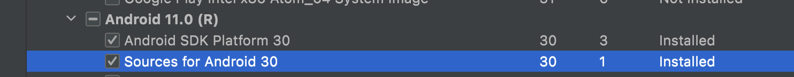

# 1. 配置插件

支持扫描隐私权限方法，替换隐私权限方法等功能。


## 1. 在跟项目的`build.gradle`文件中添加插件

```groovy
buildscript {
    repositories {
        maven { url "https://jitpack.io" }
    }

    dependencies {
        classpath 'com.github.coofee:RewritePlugin:<latest version>'
    }
}
```

最新版本：[](https://jitpack.io/#coofee/RewritePlugin)

## 2. 在`Application`项目中添加配置


```groovy
apply plugin: 'com.coofee.rewrite'

rewrite {

    scanPermissionMethodCaller {
       // ...
    }

    replaceMethod {
        // ...
    }
}
```

## 3. 执行

注意执行插件前，需要先`clean`，否会因为缓存使用旧结果。
```shell
$ ./gradlew clean
$ ./gradlew :app:assembleDebug
```

# 2. 例子

## 1. 获取android framework方法权限集

首先需要保证已通过`sdk manager`安装对应`compileSdkVersion`版本的android源代码**，如下图所示：


然后通过执行`collectAndroidPermissionMethod`任务获取android framework中需要权限的方法集：

```
$ ./gradlew :app:collectAndroidPermissionMethod
[RewritePlugin] success write to file=app/android_framework_class_method_permission.json
```

查看`android_framework_class_method_permission.json`文件的内容格式大致如下：

```json
{
  "android.telephony.TelephonyManager#getDeviceId": [
    "android.Manifest.permission.READ_PRIVILEGED_PHONE_STATE"
  ],
  "android.telephony.TelephonyManager#getImei": [
    "android.Manifest.permission.READ_PRIVILEGED_PHONE_STATE"
  ],
  "android.telephony.TelephonyManager#getMeid": [
    "android.Manifest.permission.READ_PRIVILEGED_PHONE_STATE"
  ]
}
```

## 2. scanPermissionMethodCaller（扫描隐私API方法调用）

配置`scanPermissionMethodCaller`如下所示:

> 注意：对于使用`ContentResolver`的获取`联系人/短信`等需要权限的行为，暂时不支持通过`scanPermissionMethodCaller`统计。
> 可以参考[ShadowContentResolver.java](app/src/main/java/com/coofee/rewrite/hook/content/ShadowContentResolver.java)和[replace_method](app/replace_method.json)的配置，
> 使用`replaceMethod`进行运行时拦截，统计权限获取情况。

```groovy
 scanPermissionMethodCaller {
    // 会在 replaceMethod 之后执行，所以在 replaceMethod 中配置的方法不会被统计到。
    enable = true

    // 配置未添加权限的方法，比如隐私方法等。
    configPermissionMethods = [
            "android.content.pm.PackageManager#getInstalledPackages"         : [
                    "获取应用列表"
            ] as Set,
            "android.content.pm.PackageManager#getInstalledApplications"     : [
                    "获取应用列表"
            ] as Set,

            // 高德地图
            "com.amap.api.location.AMapLocationClient#startLocation"         : [
                    "android.Manifest.permission.ACCESS_FINE_LOCATION",
            ] as Set,
            "com.amap.api.location.AMapLocationClient#startAssistantLocation": [
                    "android.Manifest.permission.ACCESS_FINE_LOCATION",
            ] as Set,

            // 百度地图
            "com.baidu.location.LocationClient#start"                        : [
                    "android.Manifest.permission.ACCESS_FINE_LOCATION",
            ] as Set,

            "android.net.wifi.WifiInfo#getMacAddress"                        : [
                    "Mac地址"
            ] as Set,
            "java.net.NetworkInterface#getHardwareAddress"                   : [
                    "Mac地址"
            ] as Set,
    ]

    // 当执行 `collectAndroidPermissionMethod` 任务成功后，
    // 会生成 android_framework_class_method_permission.json 到当前project目录中.
    configFile = file("android_framework_class_method_permission.json")

    // 输出扫描结果
    outputFile = file("scan_permission_method_caller.json")

    // 忽略android系统库
    excludes = [
            "android/", "java/", "javax/", 'com/coofee/rewrite/hook/'
    ]
}
```

然后通过如下命令编译应用：

```shell
$ ./gradlew :app:assembleDebug
[RewritePlugin] scan permission method caller result success write to file app/scan_permission_method_caller_result.json
[RewritePlugin] scan permission method caller result success write to file app/scan_permission_method_caller_result_by_module.json
```

* `scan_permission_method_caller_result.json`扫描结果文件是按照权限进行分组，样例如下：

```json
{
  "android.Manifest.permission.READ_PRIVILEGED_PHONE_STATE": [
    {
      "moduleName": "8f0a287af65fe4840370804c25783e3d59e2e135",
      "className": "com.coofee.rewrite.MainActivity",
      "methodName": "testGetDeviceId",
      "lineNo": 113,
      "permissionMethod": "android.telephony.TelephonyManager#getDeviceId"
    }
  ],
  "Mac地址": [
    {
      "moduleName": "8f0a287af65fe4840370804c25783e3d59e2e135",
      "className": "com.coofee.rewrite.MainActivity",
      "methodName": "testGetMacAddress",
      "lineNo": 122,
      "permissionMethod": "android.net.wifi.WifiInfo#getMacAddress"
    },
    {
      "moduleName": "8f0a287af65fe4840370804c25783e3d59e2e135",
      "className": "com.coofee.rewrite.MainActivity",
      "methodName": "testGetMacAddress",
      "lineNo": 126,
      "permissionMethod": "java.net.NetworkInterface#getHardwareAddress"
    }
  ]
}
```

* `scan_permission_method_caller_result_by_module.json`扫描结果文件则是按照模块名进行分组，样例如下：

```json
{
  "androidx.appcompat:appcompat:1.1.0": [
    {
      "className": "androidx.appcompat.app.TwilightManager",
      "methodName": "getLastKnownLocationForProvider",
      "lineNo": 135,
      "permissionMethod": "android.location.LocationManager#getLastKnownLocation",
      "permissions": [
        "android.Manifest.permission.ACCESS_FINE_LOCATION",
        "android.Manifest.permission.ACCESS_COARSE_LOCATION"
      ]
    }
  ],
  "8f0a287af65fe4840370804c25783e3d59e2e135": [
    {
      "className": "com.coofee.rewrite.MainActivity",
      "methodName": "testGetDeviceId",
      "lineNo": 113,
      "permissionMethod": "android.telephony.TelephonyManager#getDeviceId",
      "permissions": [
        "android.Manifest.permission.READ_PRIVILEGED_PHONE_STATE"
      ]
    },
    {
      "className": "com.coofee.rewrite.MainActivity",
      "methodName": "testGetMacAddress",
      "lineNo": 122,
      "permissionMethod": "android.net.wifi.WifiInfo#getMacAddress",
      "permissions": [
        "Mac地址"
      ]
    },
    {
      "className": "com.coofee.rewrite.MainActivity",
      "methodName": "testGetMacAddress",
      "lineNo": 126,
      "permissionMethod": "java.net.NetworkInterface#getHardwareAddress",
      "permissions": [
        "Mac地址"
      ]
    }
  ]
}
```

## 2. replaceMethod（替换方法）

在`replace_method.json`文件中配置要替换的方法，编译时会使用`dest_class.dest_method`替换`src_class.src_method`对应的方法。

```groovy
replaceMethod {
    // 启用后编译应用时会替换除`excludes`包之外的其他类的方法，可以根据`[RewritePlugin] replace`关键字过滤输出日志获取结果。
    enable = true

    // 不替换该包下的方法
    excludes = [
            'com/coofee/rewrite/hook/'
    ]

    // 配置要替换的方法
    configFile = file("replace_method.json")
}
```

`replace_method.json`文件是json数组，其结构如下所示，替换隐私API的方法配置详见：[replace_method.json](./Rewrite插件数据/replace_method.json)

```json
[
  {
    "src_class": "android.telephony.TelephonyManager",  
    "dest_class": "com.coofee.rewrite.hook.telephony.ShadowTelephoneManager",
    "methods": [
      {
        "src_method": "java.lang.String getDeviceId()",
        "dest_method": "java.lang.String getDeviceId(android.telephony.TelephonyManager)"
      },
      {
        "src_method": "java.lang.String getDeviceId(int)",
        "dest_method": "java.lang.String getDeviceId(android.telephony.TelephonyManager, int)"
      }
    ]
  }
]
```


* 结果查看：

可以使用`[RewritePlugin] replace`关键字过滤输出日志获取替换结果，单条输出如下所示：

```
[RewritePlugin] replace moduleName=8f0a287af65fe4840370804c25783e3d59e2e135, sourceFile=MainActivity.kt, lineNo=61, className=com.coofee.rewrite.MainActivity, methodName=testPackageManager, methodDesc=()V, methodSignature=null; owner=android/content/pm/PackageManager, method=getInstalledApplications, desc=(I)Ljava/util/List; by owner=com/coofee/rewrite/hook/pm/ShadowPackageManager, method=getInstalledApplications, desc=(Landroid/content/pm/PackageManager;I)Ljava/util/List;
```

* `replace_method`编写方法

1. 如果`src_method`是实例方法，则其对应的`dest_method`静态方法的第一个参数是实例自身，也就是`this`。
2. 如果`src_method`是静态方法，则其对应的`dest_method`静态方法和其一模一样。
3. 如果`src_method`方法存在泛型，在需要去掉其限定类型，见：PackageManager配置。
4. 如果`src_class`是内部类，包名的分隔符则需要使用`$`而不是`.`，见：`android.provider.Settings$System`配置。

配置例子详见：[replace_method.json](./app/replace_method.json)

## 3. dynamic-feature

当有模块是`dynamic-feature`时，需要将`application`模块中的`minifyEnabled`必须设置为true，同时在`dynamic-feature`模块中引入插件配置，否则插件对`dynamic-feature`模块不生效。

详见：`app`和`loader`模块的配置，其中`loader`是`dynamic-feature`模块。

```shell

$ ./gradlew :app:bundleDebug --info 

```

# License

RewritePlugin is licensed under the [Apache License 2.0](http://www.apache.org/licenses/LICENSE-2.0.txt).

